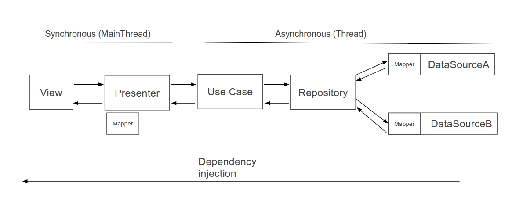
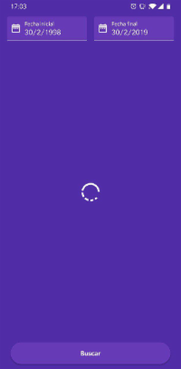

## Schibsted test code by Víctor M. Montes Llorente

### Architecture

The selected architecture is Clean architecture with MVP pattern:

### Modules organization

The Module organitation has two modules:

 - Api module: Contains api client with Retrofit configuration
 - App module: Contains packages to data sources, repositories, use cases, presenters, view and kernel

###### Data sources
Contains access data classes, from data source the app acces the whole data. The source data would be from the api or from local data (Shared Preferences, cache or local DB).
If the source data is api, then it mapping all data to domain model.

###### Repositories
The repositories responsability is call to diferents data source to get data in domain model.

###### Use cases
Contains the business logic and it can do calls to the repositories.

###### Presenter
it's responsible to know when user interact with view and to tell it what will do. Also its responsable to manage the Asynchronous threads in this case with coroutines and it calls to use cases.

###### View
Contains the user interfaces classes

###### Kernel
Contains the core tfor different classes types who per example base configuration to presenter with Coroutines.

This project contains a loading view developed by me.

### Resources
 - To get information about the historical dollar-euro exchange rates I used exchangeratesapi (https://exchangeratesapi.io/)
 - To show the information into a graphic I used MPAndroidChart library (https://github.com/PhilJay/MPAndroidChart)
